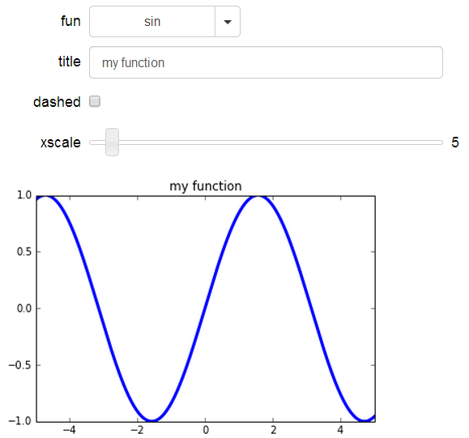
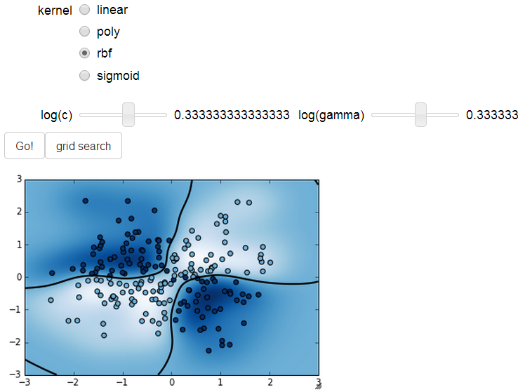
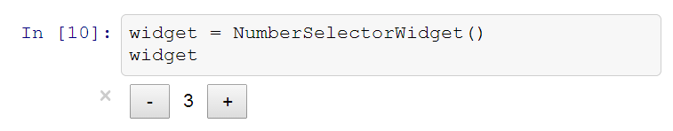

[EuroSciPy 2014](https://www.euroscipy.org/2014/schedule/presentation/60/) IPython Advanced Tutorial
========================================

* **When?** August 27th, 9-10.30
* **Where?** [IfM, Cambridge University, UK](http://www.openstreetmap.org/?mlat=52.20948&mlon=0.08736#map=17/52.20948/0.08736)
* [Chat room](https://gitter.im/rossant/euroscipy2014) (asking questions, requesting help, etc.)

Introducing the interactive features of the IPython 2.0 Notebook.

> Most of the code examples come from the [IPython Cookbook](http://ipython-books.github.io), Packt Publishing, featuring high-performance interactive computing methods for data science and mathematical modeling.

## Requirements

Simpler option is to install [Anaconda](https://store.continuum.io/cshop/anaconda/).

* Python 2.7 or Python >= 3.3
* IPython 2.2 (This has been written with the latest stable version, released in August. Some tweaking might be necessary if you use the development version 3.0.0.dev)
* NumPy
* matplotlib
* scikit-learn (part 2)
* mpld3 (part 4, `pip install mpld3`)
* networkX (part 4, `pip install networkx`)
* a recent browser:
    * Chrome >= 13
    * Safari >= 5
    * Firefox >= 6


## Installation

```
git clone https://github.com/rossant/euroscipy2014.git
cd euroscipy2014
ipython notebook --profile=euroscipy2014
```


## Contents

In this tutorial, we illustrate different features and APIs for creating interactive widgets and visualizations in the IPython notebook.


### 1. [**Calling your Python functions with graphical controls**](http://nbviewer.ipython.org/github/rossant/euroscipy2014/blob/master/01_interact.ipynb)

We show how to use the `@interact` decorator to create simple GUI controlling Python functions in real time.




### 2. [**Creating a GUI in the notebook**](http://nbviewer.ipython.org/github/rossant/euroscipy2014/blob/master/02_gui.ipynb)
    
Elaborating on the previous example, we show how to create a more complex GUI with custom positioning, styling, and logic. The entire GUI is implemented in Python: there is no JavaScript code to write at this point.




### 3. [**Creating a custom notebook widget with backbone.js**](http://nbviewer.ipython.org/github/rossant/euroscipy2014/blob/master/03_custom.ipynb)

In this part, we create an entirely custom widget with HTML, JavaScript, and backbone.js. We show how custom widgets can be designed to play well with the rest of the widget machinery.


### 4. [**Interactive data visualization in the notebook**](http://nbviewer.ipython.org/github/rossant/euroscipy2014/blob/master/04_dataviz.ipynb)

In this part, we explore several interactive data visualization solutions in the notebook, mostly based on the **d3.js** JavaScript library. We first show how to easily make matplotlib figures interactive in the notebook with **mpld3**.

Then, we introduce the *very* basics of d3.js, and we show how to render a networkX graph dynamically in the notebook. There is some JavaScript code to write here.



## Further reading

* [Documentation of the IPython widgets](http://nbviewer.ipython.org/github/ipython/ipython/blob/master/examples/Interactive%20Widgets/Index.ipynb)
* [IPython in depth](http://nbviewer.ipython.org/github/ipython/ipython-in-depth/tree/master/examples/Interactive%20Widgets/)
* [IPython Cookbook](http://ipython-books.github.io)

